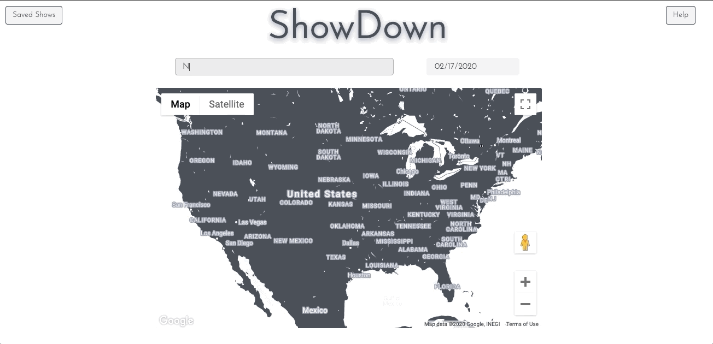

# ShowDown

ShowDown is a simple interface for finding nearby live events and music, built with AngularJS, jQuery, and AJAX and utilizing the Ticketmaster and Google Maps APIs.

Built in around a week in December 2016 as the final project of "User Interface Design" (COMS 4170) at Columbia University, ShowDown was developed by Maurice Goldberg, Savvas Petridis, Tin Nilar Hlaing, and Anush Ramsurat. Maurice has since returned to the project in February 2020 to update the API calls and polish the design scheme.

# Features

## Location search
The user can find events by city and date by typing into the input bar, selecting the desired date from the calendar dropdown, and pressing enter. The rendered map populates and re-centers dynamically based on the user's input. To check out a new city after already searching, type the desired location in the input bar and press enter twice.

## View events details
The user can view event details, such as the venue, date and time of event, venue address, ticket link, and phone number, all dynamically rendered in a side panel to the right of the map.

## Save events
Save events to be viewed at a later date by clicking the "Save" button at the bottom of the side panel.

## View & remove saved shows
The user can view all saved shows by clicking the "Saved Shows" button on the top-left of the screen. The map re-renders with all saved shows populated across the United States.
The user can remove one or all saved shows by clicking "Remove Selected" or "Clear Saved" respectively.

## Help button
The user can view an help modal that explains how to use the app by clicking the "Help" button in the top-right corner of the screen.
